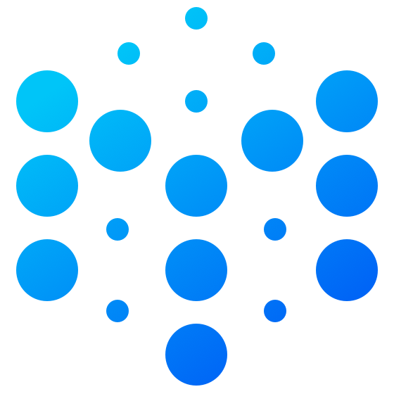

<div align="center">

 
 <h1>Molecule</h1>
 <h3>경량 웹 IDE UI 프레임워크</h3>

[![CI][ci-image]][ci-url] [![CII Best Practices][cii-img]][cii-url] [![Codecov][codecov-image]][codecov-url] [![NPM downloads][download-img]][download-url] [![NPM version][npm-version]][npm-version-url] [![Chat][online-chat-img]][online-chat-url]

</div>

[ci-image]: https://github.com/DTStack/molecule/actions/workflows/main.yml/badge.svg
[ci-url]: https://github.com/DTStack/molecule/actions/workflows/main.yml
[codecov-image]: https://codecov.io/gh/DTStack/molecule/branch/main/graph/badge.svg?token=PDjbCBo6qz
[codecov-url]: https://codecov.io/gh/DTStack/molecule
[download-img]: https://img.shields.io/npm/dm/@dtinsight/molecule.svg?style=flat
[download-url]: https://www.npmjs.com/package/@dtinsight/molecule
[npm-version]: https://img.shields.io/npm/v/@dtinsight/molecule.svg?style=flat-square
[npm-version-url]: https://www.npmjs.com/package/@dtinsight/molecule
[online-chat-img]: https://img.shields.io/discord/920616811261743104?logo=Molecule
[online-chat-url]: https://discord.com/invite/b62gpHwNA7
[cii-img]: https://bestpractices.coreinfrastructure.org/projects/6307/badge
[cii-url]: https://bestpractices.coreinfrastructure.org/projects/6307

[中文](./README-zhCN.md) | [English](./README.md) | [한국어](./README-koKR.md)

**Molecule**은 React.js로 구축되었으며 VSCode에서 영감을 받은 경량 **웹 IDE UI** 프레임워크입니다. 개발자가 워크벤치를 더 쉽게 확장할 수 있도록 VSCode와 유사한 확장 API를 설계했습니다. Molecule을 React.js 애플리케이션과 통합하는 것이 편리합니다. [DTStack](https://www.dtstack.com/)의 많은 제품들에 이 코드가 적용되었습니다.

[온라인 미리보기](https://dtstack.github.io/molecule-examples/#/)

## 기능들

-   Visual Studio Code **워크벤치** UI 제공  
    (https://code.visualstudio.com/api/extension-capabilities/extending-workbench)
-   VSCode **ColorTheme** 와 호환
-   **React Component**를 통해 워크벤치를 쉽게 사용자 정의
-   Monaco-Editor **Command Palette, Keybinding** 기능 내장
-   **i18n** 지원, 중국어 간체, 영어 , 한국어 지원
-   **설정** 지원 , Extension을 통한 편집 및 확장 지원
-   기본 **Explorer, Search** 컴포넌트 지원, Extension을 통환 확장 지원
-   **Typescript** 지원

## 설치

```bash
npm install @dtinsight/molecule
# Or
yarn add @dtinsight/molecule
```

## 기본 사용법

```javascript
import React from 'react';
import ReactDOM from 'react-dom';
import { create, Workbench } from '@dtinsight/molecule';
import '@dtinsight/molecule/esm/style/mo.css';

const moInstance = create({
    extensions: [],
});

const App = () => moInstance.render(<Workbench />);

ReactDOM.render(<App />, document.getElementById('root'));
```

`extension`은 확장 응용 프로그램 항목입니다. 확장에 대한 자세한 내용은 [빠른 시작](https://dtstack.github.io/molecule/docs/quick-start)을 참조하십시오.

## 문서

-   [소개](https://dtstack.github.io/molecule/docs/introduction)
-   [빠른 시작](https://dtstack.github.io/molecule/docs/quick-start)
-   [API](https://dtstack.github.io/molecule/docs/api)
-   [확장 워크벤치](https://dtstack.github.io/molecule/docs/guides/extend-workbench)
-   [예제들](https://github.com/DTStack/molecule-examples)

## 개발

```bash
git clone git@github.com:DTStack/molecule.git
```

로컬에 소스코드를 클론 하세요

**개발 모드**

```bash
yarn # Install dependencies

yarn dev # Start dev mode
```

Molecule은 React 컴포넌트를 개발,관리하기 위해 **Storybook**을 사용합니다.
기본 링크는 `http://localhost:6006/` 입니다.

**테스트**

```bash
yarn test -u
```

**빌드 & 미리보기**

```bash
yarn build # Compile to ESM
yarn web # Web Preview Mode
```

소스 코드를 ES6 모듈로 컴파일하고 **`esm`** 폴더에 출력 합니다. 스토리북 개발 모드 외에도 ESM 모듈을 사용하는 **Web Preview** 모드도 내장되어 있습니다.

## 기여

자세한 사항은 [기여](./CONTRIBUTING.md)을 참조하세요.

## 라이선스

Copyright © DTStack. All rights reserved.

MIT 라이선스에 따라 라이선스가 부여됩니다.
