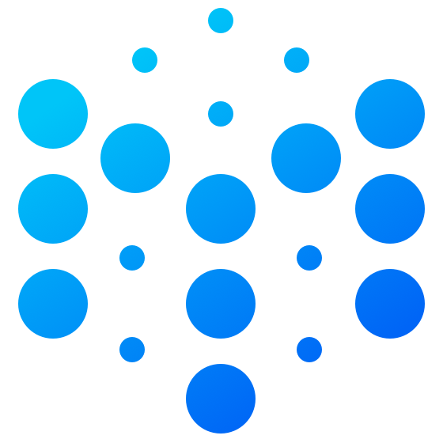

<div align="center">

 
 <h1>Molecule</h1>
 <h3>一个轻量的 Web IDE UI 框架</h3>

[![CI][ci-image]][ci-url] [![CII Best Practices][cii-img]][cii-url] [![Codecov][codecov-image]][codecov-url] [![NPM downloads][download-img]][download-url] [![NPM version][npm-version]][npm-version-url] [![Chat][online-chat-img]][online-chat-url]

</div>

[ci-image]: https://github.com/DTStack/molecule/actions/workflows/main.yml/badge.svg
[ci-url]: https://github.com/DTStack/molecule/actions/workflows/main.yml
[codecov-image]: https://codecov.io/gh/DTStack/molecule/branch/main/graph/badge.svg?token=PDjbCBo6qz
[codecov-url]: https://codecov.io/gh/DTStack/molecule
[download-img]: https://img.shields.io/npm/dm/@dtinsight/molecule.svg?style=flat
[download-url]: https://www.npmjs.com/package/@dtinsight/molecule
[npm-version]: https://img.shields.io/npm/v/@dtinsight/molecule.svg?style=flat-square
[npm-version-url]: https://www.npmjs.com/package/@dtinsight/molecule
[online-chat-img]: https://img.shields.io/discord/920616811261743104?logo=Molecule
[online-chat-url]: https://discord.com/invite/b62gpHwNA7
[cii-img]: https://bestpractices.coreinfrastructure.org/projects/6307/badge
[cii-url]: https://bestpractices.coreinfrastructure.org/projects/6307

[中文](./README-zhCN.md) | [English](./README.md) | [한국어](./README-koKR.md)

Molecule 是一款受 **VSCode** 启发，使用 **React.js** 构建的 **Web IDE UI** 框架。我们设计了类似 VSCode 的**扩展**（Extension)机制，可以帮助我们使用 React 组件快速完成对 Workbench 的自定义。Molecule 与 **React** 项目集成非常方便，我们已经在 [DTStack](https://www.dtstack.com/) 多个产品、项目中使用。

[在线预览](https://dtstack.github.io/molecule-examples/#/)

## 核心功能

-   内置 React 版本的 Visual Studio Code **Workbench** UI
-   基本兼容 Visual Studio Code 的 **ColorTheme**
-   支持使用 React 组件自定义 **Workbench** UI 样式
-   内置 Monaco Editor **Command Palette**、**Keybinding**等模块，并支持扩展
-   支持 **i18n**，简体中文、English 、한국어 3 种语言
-   内置一个简单的 **Settings** 模块，支持在线编辑修改以及扩展
-   内置默认的 **Explorer**, **Search** 等组件，并支持扩展
-   Typescript 支持

## 安装

```bash
npm install @dtinsight/molecule
# Or
yarn add @dtinsight/molecule
```

## 基本使用

```javascript
import React from 'react';
import ReactDOM from 'react-dom';
import { create, Workbench } from '@dtinsight/molecule';
import '@dtinsight/molecule/esm/style/mo.css';

const moInstance = create({
    extensions: [],
});

const App = () => moInstance.render(<Workbench />);

ReactDOM.render(<App />, document.getElementById('root'));
```

`extension` 为 Workbench 应用的扩展入口，如何编写扩展，请参考[快速开始](https://dtstack.github.io/molecule/docs/quick-start)。

## 文档

-   [简介](https://dtstack.github.io/molecule/docs/introduction)
-   [快速开始](https://dtstack.github.io/molecule/docs/quick-start)
-   [API 文档](https://dtstack.github.io/molecule/docs/api)
-   [扩展 Workbench](https://dtstack.github.io/molecule/docs/guides/extend-workbench)
-   [Examples](https://github.com/DTStack/molecule-examples)

## 开发

````bash
git clone git@github.com:DTStack/molecule.git
``
`
首先 Clone 源码到本地
**开发模式**

```bash
yarn # install dependencies

yarn dev # 启动开发模式
````

Molecule 中的组件是基于 Storybook 开发并管理的，预览地址：`http://localhost:6006/`默认地址浏览。

**测试**

```bash
yarn test -u
```

**构建 & 预览**

```bash
yarn build
yarn web # 预览打包后的 Web
```

当前我们默认将 Molecule 以 `ES6` 模块的方式构建到 **`esm`** 目录。另外，
这里除了 Storybook 提供的组件预览模式以外，我们同时内置了一个使用 ESM 模块的 `Web` 预览模式。

## 贡献

更多请参考 [CONTRIBUTING](./CONTRIBUTING.md).

## 交流

我们使用[钉钉](https://www.dingtalk.com/) 沟通交流，可以搜索群号 `30537511` 或者扫描下面的二维码进入钉钉群

<div align="center"> 
 
</div>

## License

Copyright © DTStack. All rights reserved.

Licensed under the MIT license.
