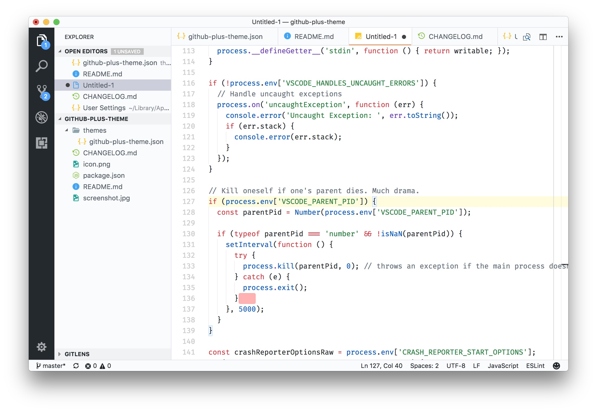

# GitHub Plus Theme

A full [VSCode](https://code.visualstudio.com/) editor theme inspired by the
GitHub color scheme.

Use [GitHub issues](https://github.com/thenikso/github-plus-theme) to report problems/requests (it might take a while to get feedback)

## Extras

-   [Material Icon Theme](https://marketplace.visualstudio.com/items?itemName=PKief.material-icon-theme)
    is the suggested icon theme
-   [Trailing Spaces](https://marketplace.visualstudio.com/items?itemName=shardulm94.trailing-spaces)
    can be seen in the screenshot for trailing whitespaces highlight
